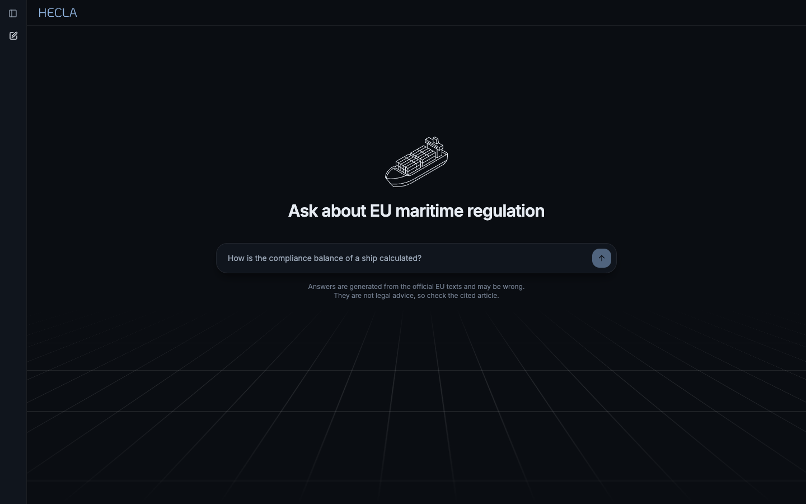

# RegRag

A retrieval-augmented question answering system over EU maritime emissions law,
where every answer cites the article it came from.

Shipping companies trading in Europe now answer to three EU emissions laws:

- The [MRV Regulation](https://eur-lex.europa.eu/legal-content/EN/TXT/?uri=CELEX:32015R0757)
  (2015/757) makes them monitor, report and verify each ship's emissions.
- The [FuelEU Maritime Regulation](https://eur-lex.europa.eu/legal-content/EN/TXT/?uri=CELEX:32023R1805)
  (2023/1805) limits the greenhouse gas intensity of the energy a ship uses.
- The [EU ETS Directive](https://eur-lex.europa.eu/legal-content/EN/TXT/?uri=CELEX:32003L0087)
  (2003/87/EC) has covered shipping since 2024. Companies surrender
  allowances for the emissions verified under MRV.

RegRag covers the two regulations today, plus the delegated and implementing
acts made under them. The ETS Directive is not in the corpus yet. The text is
long, amended often, and cross-references itself constantly. RegRag keeps a
current copy of that corpus and answers questions against it, returning the
exact articles it relied on rather than a paraphrase to take on trust.

## How it works

- **Discovery** queries CELLAR for every act with FuelEU or MRV as its legal
  basis, then resolves each to its latest consolidated version by CELEX number.
- **Ingestion** runs incrementally: unchanged documents are neither
  re-downloaded nor re-embedded, so keeping the corpus current is cheap.
- **Retrieval** fuses a vector leg and a full-text leg with Reciprocal Rank
  Fusion inside one SQL query, then reranks with a cross-encoder. Stored
  cross-references let a hit be followed to the article it cites.
- **Answering** streams one model call over the retrieved articles, marking
  each claim with the block it came from. A question the corpus does not cover
  is refused before any model call rather than answered from what the model
  happens to know.
- **Evaluation** scores a golden dataset of authored questions through the same
  graph the API runs: what retrieval found, what the answers cited, and what
  the refusal gate caught.

Each stage lives in its own package, documented where it is implemented:

| Directory                                                | Contents                                                        |
| -------------------------------------------------------- | --------------------------------------------------------------- |
| [`backend/app/ingestion/`](backend/app/ingestion/README.md) | Discovery through embedding: how the corpus is built            |
| [`backend/app/retrieval/`](backend/app/retrieval/README.md) | Hybrid search and exact article lookup: how it is searched      |
| [`backend/app/chat/`](backend/app/chat/README.md)           | The answering graph and its SSE endpoint                        |
| [`backend/app/evals/`](backend/app/evals/README.md)         | The golden dataset and the runner that scores the graph on it   |
| [`frontend/`](frontend/)                                    | User interface (React, TanStack, Tailwind)                      |

Setup, commands and configuration are in [`backend/README.md`](backend/README.md).
The interface has its own README in [`frontend/`](frontend/).
